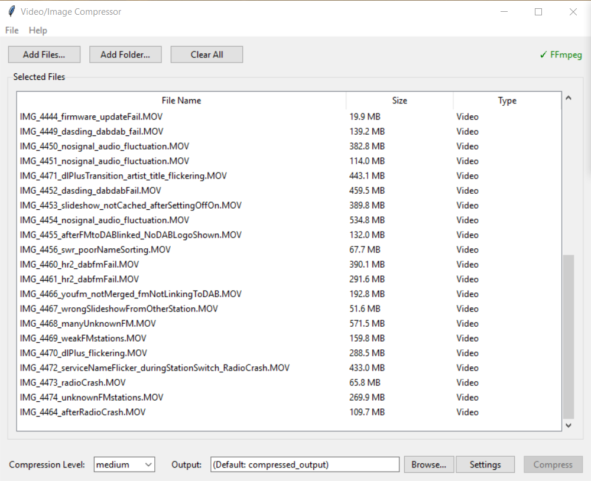
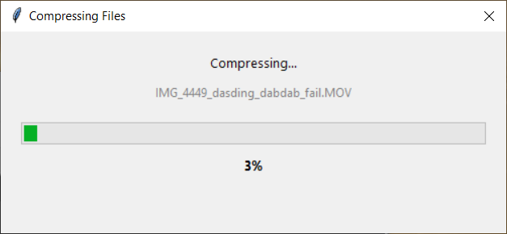

# Video/Image Compressor

[](https://github.com/CJ-1981/video-compressor/actions/workflows/build.yml)

A desktop application for compressing videos and images using FFmpeg. Provides a user-friendly GUI with configurable compression levels, progress visualization, and flexible output options.

**[Download Latest Release](https://github.com/CJ-1981/video-compressor/releases/latest)** - Standalone Windows executable (FFmpeg included)

## Screenshots

### Main Application Window


### Progress Dialog


## Features

- **Video Compression**: Compress MP4, MOV, AVI, MKV, and other video formats
- **Image Compression**: Compress JPG, PNG, WebP images
- **Apple MOV Support**: Proper handling of iPhone MOV recordings (H.264/H.265)
- **Batch Processing**: Compress multiple files at once
- **Progress Tracking**: Real-time progress updates with time estimates
- **Abort Functionality**: Stop compression anytime with proper FFmpeg process termination
- **Drag & Drop**: Drag files directly into the application window
- **File Management**: Remove individual files or clear all with keyboard shortcuts
- **Configurable Quality**: Three compression levels (low, medium, high)
- **Flexible Output**: Common output directory or per-folder subdirectories
- **FFmpeg Based**: Industry-standard compression quality

## Requirements

- Python 3.8 or higher
- FFmpeg (must be installed separately)

### Installing FFmpeg

**Windows:**
```bash
# Using Chocolatey
choco install ffmpeg

# Or download from https://ffmpeg.org/download.html
```

**macOS:**
```bash
brew install ffmpeg
```

**Linux:**
```bash
sudo apt update
sudo apt install ffmpeg
```

## Installation

### Option 1: Standalone Executable (Recommended)

1. Download the latest `VideoCompressor.exe` from [Releases](https://github.com/CJ-1981/video-compressor/releases)
2. No installation required - FFmpeg is included
3. Just run the executable

### Option 2: From Source

1. Clone or download this repository
2. Install required dependencies:
   ```bash
   pip install tkinterdnd2
   ```
3. Ensure FFmpeg is in your system PATH or configure the path in Settings

### Building from Source

To create a standalone executable:

1. Install PyInstaller:
   ```bash
   pip install pyinstaller
   ```

2. Download FFmpeg static build:
   - Windows: https://www.gyan.dev/ffmpeg/builds/ (ffmpeg-release-essentials.zip)
   - Extract and copy `ffmpeg.exe` and `ffprobe.exe` to project root

3. Build the executable:
   ```bash
   python build_exe.py
   ```

The executable will be created in `dist/VideoCompressor.exe` and includes FFmpeg.

## Usage

### Running the Application

```bash
python main.py
```

### Basic Workflow

1. **Add Files**: Use any of these methods:
   - Click "Add Files..." or "Add Folder..." buttons
   - Drag and drop files/folders onto the window
   - Drag and drop files onto the file list
2. **Manage Files** (optional):
   - Click "Remove Selected" to remove specific files
   - Press `Delete` or `Backspace` to remove selected files
   - Right-click for context menu (Remove Selected / Clear All)
   - Click "Clear All" to remove all files
3. **Choose Level**: Select compression level (Low/Medium/High)
4. **Configure Output** (optional): Click "Browse..." to set output directory
5. **Compress**: Click "Compress" to start
6. **Monitor Progress**: View progress in the dialog window with time estimates
7. **Abort**: Click red "Abort" button to stop compression (FFmpeg processes terminated immediately, partial files cleaned up)

### Settings

Access via **File → Settings**:

**General Tab:**
- Common output directory (adds compression level suffix to filenames)
- Default subdirectory for per-folder output
- Preserve original files option
- FFmpeg path configuration

**Video Tab:**
- CRF (Constant Rate Factor) - lower = better quality
- Preset (compression speed) - faster = larger files
- Audio bitrate settings

**Image Tab:**
- Quality level (1-100)

### Output Naming

**Common Output Mode:**
- Files go to single directory
- Compression level added to filename
- Example: `video.mp4` → `video_medium.mp4`

**Subdirectory Mode (default):**
- Files go to `compressed_output/` subdirectory in source location
- Original filenames preserved
- Example: `videos/video.mp4` → `videos/compressed_output/video.mp4`

## Compression Levels

### Video
| Level | CRF | Preset | Quality | File Size |
|-------|-----|--------|---------|-----------|
| Low   | 28  | slow   | Smallest | ~50% reduction |
| Medium| 23  | medium | Balanced | ~30% reduction |
| High  | 18  | fast   | Best | ~10% reduction |

### Image
| Level | Quality | Description |
|-------|---------|-------------|
| Low   | 70      | Maximum compression |
| Medium| 80      | Balanced |
| High  | 90      | Minimal compression |

## Supported Formats

### Video
- MP4, MOV, AVI, MKV, FLV, WMV
- WebM, M4V, MPG, MPEG, 3GP, TS, M2TS, MTS

### Image
- JPG/JPEG, PNG, WebP, BMP, TIFF, GIF

## Project Structure

```
video_compressor/
├── main.py                 # Application entry point
├── gui/
│   ├── main_window.py      # Main GUI window
│   ├── progress_dialog.py  # Progress visualization
│   └── config_dialog.py    # Settings dialog
├── compressor/
│   ├── base.py             # Base compressor interface
│   ├── video.py            # Video compression logic
│   └── image.py            # Image compression logic
├── config/
│   └── presets.json        # Default compression settings
└── utils/
    └── ffprobe.py          # FFprobe wrapper for file info
```

## Troubleshooting

**"FFmpeg not found" error:**
- Install FFmpeg and ensure it's in your system PATH
- Or configure the FFmpeg path in Settings

**Compression fails:**
- Ensure input file is not corrupt
- Check disk space availability
- Verify write permissions for output directory

**Apple MOV files:**
- iPhone recordings are fully supported
- Output defaults to MP4 format for compatibility
- Original MOV format preserved in subdirectory mode

**Drag & Drop not working:**
- Install tkinterdnd2: `pip install tkinterdnd2`
- Restart the application after installation

**Abort button doesn't stop compression:**
- This should now work correctly with aggressive process termination
- FFmpeg processes are killed within milliseconds of clicking Abort
- Partial output files are automatically cleaned up

## License

This project is provided as-is for personal use.
